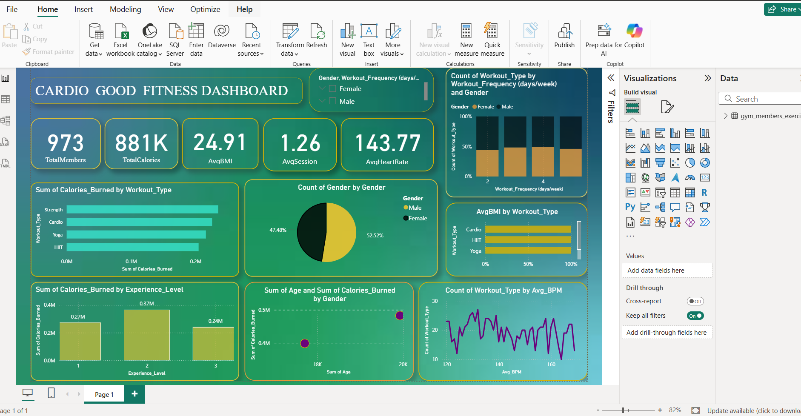

# Fitness Analytics Dashboard 🏋️‍♂️📊



A **professional fitness analytics dashboard** built in **Power BI** to track, visualize, and analyze gym members’ data for insights on workouts, calories burned, heart rate, BMI, and overall fitness trends. Ideal for trainers, gym managers, and fitness enthusiasts.

---

## 🎯 Dataset Overview

The dashboard uses the dataset `gym_members_exe` with the following columns:

| Column Name | Description |
|-------------|-------------|
| Age | Member's age |
| Avg_BPM | Average heart rate during workout |
| BMI | Body Mass Index |
| Calories_Burned | Calories burned during sessions |
| Experience_Level | Beginner, Intermediate, Advanced |
| Fat_Percentage | Body fat percentage |
| Gender | Male / Female |
| Height | Member height in cm |
| Max_BPM | Maximum heart rate recorded |
| Resting_BPM | Resting heart rate |
| Session_Duration | Workout session duration (minutes) |
| Water_Intake | Daily water intake |
| Weight | Member weight in kg |
| Workout_Frequency | Number of workout sessions per week |
| Workout_Type | Type of workout (Cardio, Strength, etc.) |

> This dataset is ideal for creating an **interactive and professional fitness dashboard**.

---

## 🚀 STEP 1: Key Measures (DAX)

Create **New Measures** in Power BI under `Modeling → New Measure`:

```DAX
-- Total Calories Burned
TotalCalories = SUM('gym_members_exe'[Calories_Burned])

-- Average BMI
AvgBMI = AVERAGE('gym_members_exe'[BMI])

-- Average Session Duration
AvgSession = AVERAGE('gym_members_exe'[Session_Duration])

-- Average Heart Rate
AvgHeartRate = AVERAGE('gym_members_exe'[Avg_BPM])

-- Total Members
TotalMembers = COUNTROWS('gym_members_exe')

-- High Intensity Members (Optional)
HighIntensity = 
CALCULATE(
    COUNTROWS('gym_members_exe'),
    'gym_members_exe'[Avg_BPM] > 150
)

```

## 📊 STEP 2: Dashboard Layout

### 1️⃣ Top Section: KPI Cards
Add **5 card visuals**:

- **Total Members**  
- **Total Calories Burned**  
- **Average BMI**  
- **Average Session Duration**  
- **Average Heart Rate**  

> Use **large fonts and bold visuals** for a professional appearance.

---

### 2️⃣ Middle Section: Charts

| Chart | Type | Axis | Values |
|-------|------|------|--------|
| Calories by Workout Type | Bar Chart | Workout_Type | SUM(Calories_Burned) |
| Gender Distribution | Pie Chart | Gender | COUNTROWS |
| Experience Level vs Calories | Column Chart | Experience_Level | SUM(Calories_Burned) |
| BMI vs Fat Percentage | Scatter Plot | BMI | Fat_Percentage |

---

### 3️⃣ Bottom Section: Workout Frequency

- **Chart Type:** Column / Histogram  
- **Axis:** Workout_Frequency  
- **Values:** COUNTROWS  

---

### 4️⃣ Slicers (Interactive Filters)

Add slicers for:  

- Gender  
- Workout_Type  
- Experience_Level  

> These slicers make the dashboard **interactive and dynamic**.
⚡ Technologies Used

Power BI – Interactive data visualization

DAX – For calculations and measures

Slicers & Filters – Interactive filtering

Professional Layout & Theme – White background, blue & green highlights

---

📁 Project Structure
```Fitness-Dashboard/
│
├── dataset/
│   └── gym_members_exe.csv
├── README.md
└── PowerBI_Dashboard.pbix
```
---

🖋 Author

Shubham Raut

Data Analyst & Power BI Developer
